# Shahem inventory
- Shahem inventory is a site that hopes to demonstrate how pure python works in a real-world context. 
- The site will be targeted users who want to get report over there inventory after the inter data.
- It will show that the storage is full if the stock for ech item arrive to 1000
- Shahem inventory is a application will have a command line interface in python.
- Shahem inventory site will show the users the a lest of options:
  - Add sales.
  - Add buy.
  - Add damage.
  - Return to stock.
  - Return to damage.
  - Storage capacity.
  - Exit.

[Shahem inventory](https://shahem-inventory.herokuapp.com/) site.

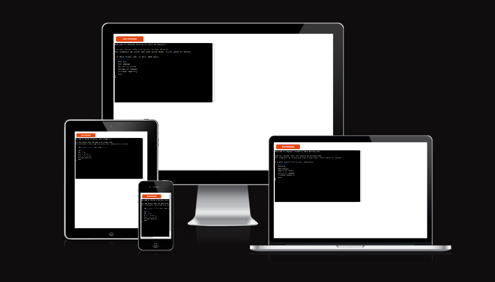

# Navigator

- [**User experience UX**](<#user-experience-ux>)
    - [User stories](<#user-stories>)
    - [Flow chart diagram](<#flow-chart-diagram>)
    - [Site structure](<#site-structure>)
    - [Data Model](<#data-model>)
- [**Features**](<#features>)
    - [Existing features](<#existing-features>)
    - [Python functions](<#python-functions>)
        - [Show list](<#show-list>)
        - [Main](<#main>)
        - [Go back](<#go-back>)
        - [Main sales](<#main-sales>)
        - [Main buy](<#main-buy>)
        - [Main damage](<#main-damage>)
        - [Main return stock](<#main-return-stock>)
        - [Main return damage](<#main-return-damage>)
        - [Storage capacity](<#storage-capacity>)
        - [Get input](<#get-input>)
        - [Validate data](<#validate-data>)
        - [Update worksheet](<#update-worksheet>)
        - [Calculate total](<#calculate-total>)
        - [Update stock worksheet deduct](<#update-stock-worksheet-deduct>)
        - [Update stock worksheet add](<#update-stock-worksheet-add>)
        - [Update damage worksheet add](<#update-damage-worksheet-add>)
    - [Future features](<#future-features>)
- [**Technologies used**](<#technologies-used>)
- [**Python Packages**](<#python-Packages>)        
- [**Testing**](<#testing>)
    - [Code Validation](<#code-validation>)
    - [Browser Compatibility](<#browser-compatibility>)
    - [Responsiveness Test](<#responsiveness-test>)
    - [Lighthouse](<#lighthouse>)
    - [Manual testing](<#manual-testing>)
    - [User stories testing](<#user-stories-testing>)
    - [Fixed bugs](<#Fixed-bugs>)

# User experience (UX)

## User stories

- As a user, I want to understand the purpose of this site upon loading it.
- As a user, I want to be able to know what are the instructions to use this site.
- As a user, I want to be able to add sales to the total sales and update the stock.
- As a user, I want to be able to add buy to the total buy and update the stock.
- As a user, I want to be able to add damage to the total damage and update the stock.
- As a user, I want to be able to return to stock update the stock.
- As a user, I want to be able to return to damage update the damage.
- As a user, I want to be able to see storage capacity.
- As a user, I want to be able to exit site.
- As a user I want have an easy way of getting back to the main menu.

[Back to top](<#navigator>)

## Flow chart diagram

- The site steps overview.
- Explain the flow of the site.
- Shows the sequence of triggering the site's functionalities.
- Plan and write efficient functions.

<b>Flow chart diagram</b>

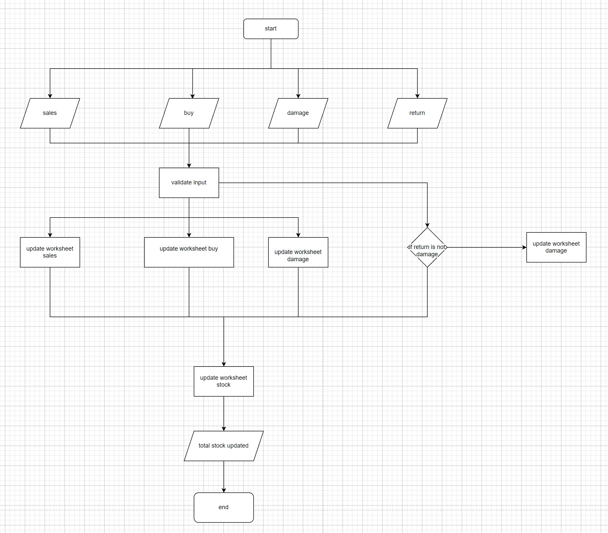

 

[Back to top](<#navigator>)

## Site structure

- Shahem inventory is a terminal based application that is being presented in a one page website.
- When the application starts the user see a short welcome message, the instructions and a list of choices
 
[Back to top](<#navigator>)

## Data Model

To store all data in the application I made a choice to use Google Sheets. All data in the application is being sent and retrieved from the Google Sheet.

- Name of workbook: shahem_inventory
- Name of worksheet: sales
- Name of worksheet: buy
- Name of worksheet: damage
- Name of worksheet: stock

The worksheet holds 6 columns with information such as:
  T-shirt XS,T-shirt S,T-shirt M,T-shirt L,T-shirt XL,T-shirt XXL 
  that is being controlled from the application via Python.

 

<b>Google Sheet sales</b>

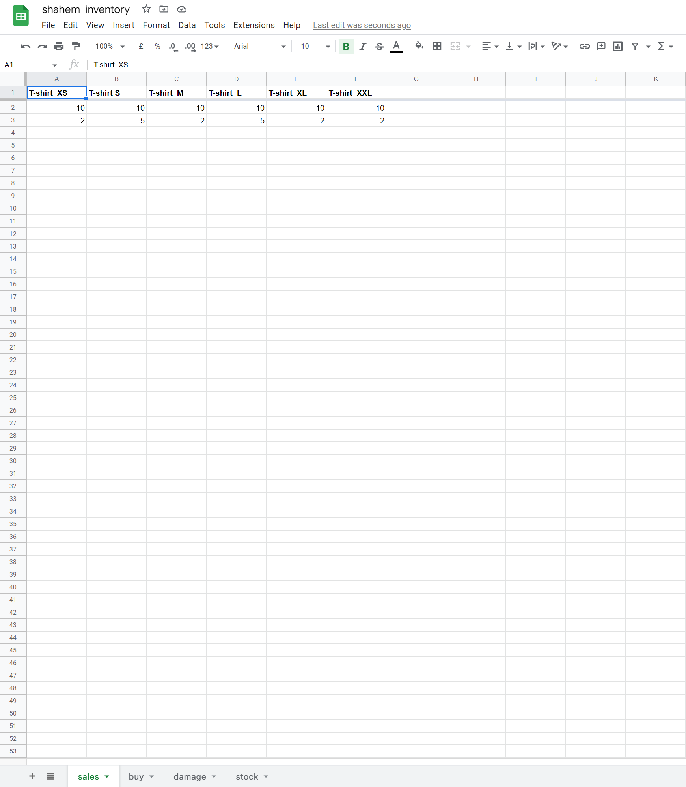

 
 

<b>Google Sheet buy</b>

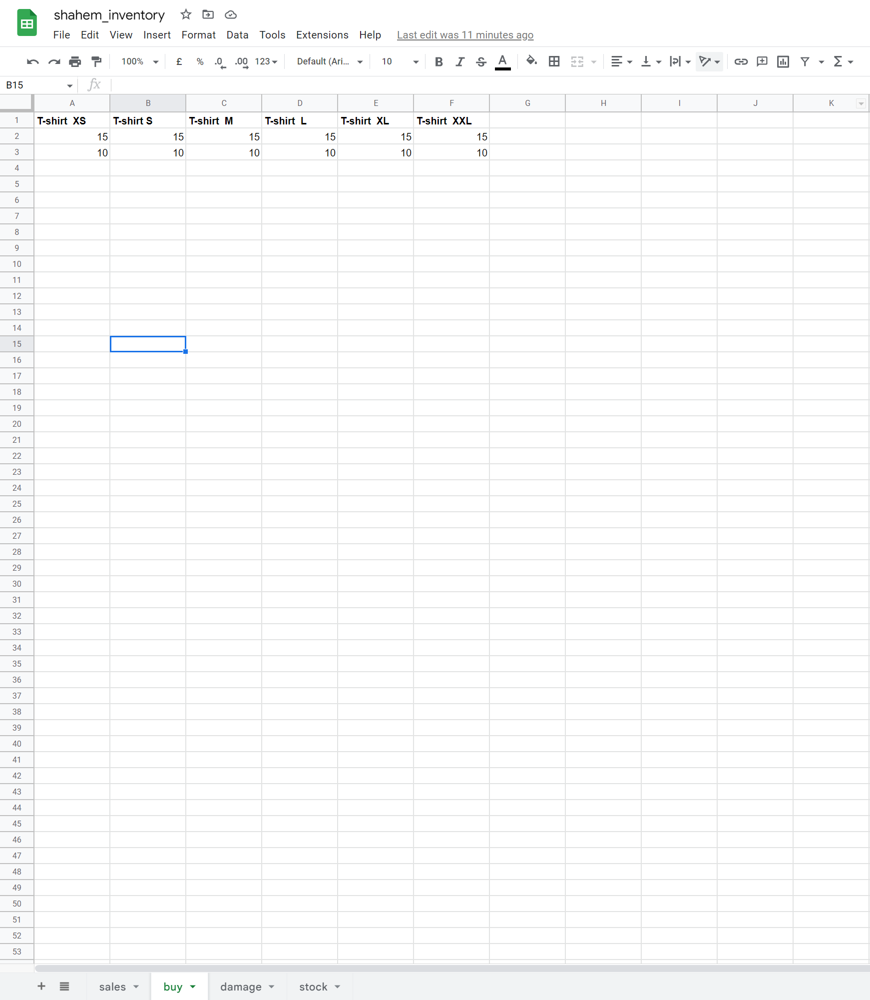

 

<b>Google Sheet damage</b>

 
 

<b>Google Sheet stock</b>

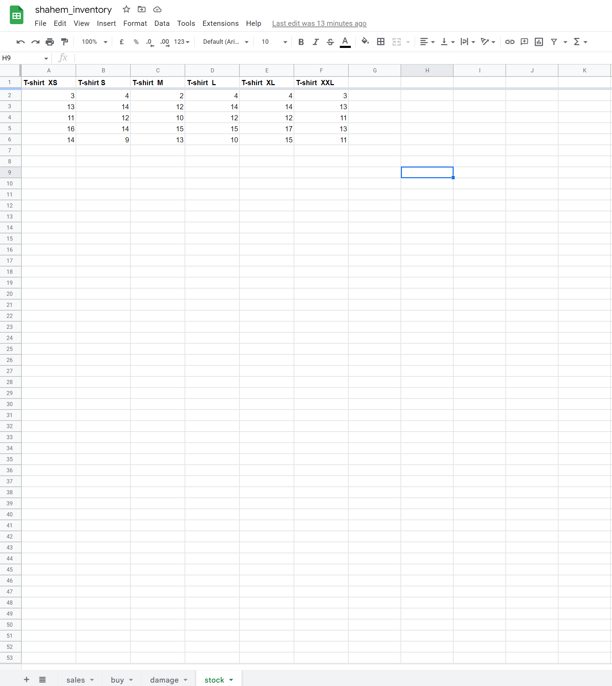

 

[Back to top](<#navigator>)

# Features 

## Existing features

## Python functions

### Show list

<b>Show list</b>

 

[Back to top](<#navigator>)

### Main

<b>Main</b>

 

[Back to top](<#navigator>)

### Go back

<b>Go back</b>

 

[Back to top](<#navigator>)

### Main sales

<b>Main sales</b>

 

[Back to top](<#navigator>)

### Main buy

<b>Main buy</b>

 

[Back to top](<#navigator>)

### Main damage

<b>Main damage</b>

 

[Back to top](<#navigator>)

### Main return stock

<b>Main return stock</b>

 

[Back to top](<#navigator>)

### Main return damage

<b>Main return damage</b>

 

[Back to top](<#navigator>)

### Storage capacity

<b>Storage capacity</b>

 

[Back to top](<#navigator>)

### Get input

[Back to top](<#navigator>)

### Validate data

[Back to top](<#navigator>)

### Update worksheet

[Back to top](<#navigator>)

### Calculate total

[Back to top](<#navigator>)

### Update stock worksheet deduct

[Back to top](<#navigator>)

### Update stock worksheet add

[Back to top](<#navigator>)

### Update damage worksheet add

[Back to top](<#navigator>)

# Technologies used
- [Python](https://en.wikipedia.org/wiki/Python_(programming_language)) - Provides the functionality for the application.
- [Google Sheets](https://www.google.co.uk/sheets/about/) - Used to host the application data.
-  - used to create the flow chart diagram.
- [Gitpod](https://www.gitpod.io/#get-started) - used to deploy the website.
- [Github](https://github.com/) - used to host and edit the website.
- [Heroku](https://en.wikipedia.org/wiki/Heroku) - A cloud platform that the application is deployed to.

[Back to top](<#navigator>)

# Python Packages
- [GSpread](https://pypi.org/project/gspread/) - A Python package that makes it possible to transfer data between the application and the Google Sheet.
- [Sys](https://docs.python.org/3/library/sys.html) - A module that provides access to used or maintained by the interpreter and to functions that interact strongly with the interpreter. It is always available (*text taken from [here](https://docs.python.org/3/library/sys.html)*)
- [OS](https://docs.python.org/3/library/os.html) - A module that provides a portable way of using OS dependent functionality.
- [inquirer]() - python package provides list of choices
- [Time](https://docs.python.org/3/library/time.html) - A module that provides various time-related functions

[Back to top](<#navigator>)

# Testing 

## Code Validation

### Python

* No errors were returned when passing through the official [CI Python Linter](https://pep8ci.herokuapp.com/)

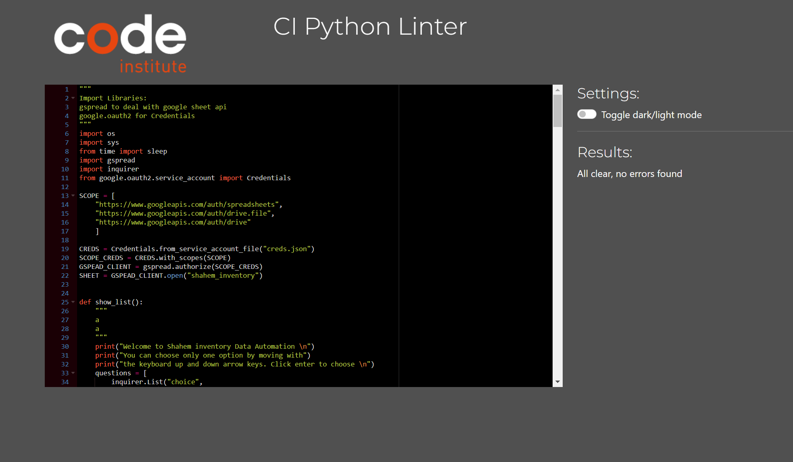

[Back to top](<#navigator>)

## Browser Compatibility

- Shahem inventory site was tested on the following browsers Google Chrome, Safari and Mozilla Firefox.
- Appearance, functionality and responsiveness were consistent on a range of different device sizes and browsers.

[Back to top](<#navigator>)

## Responsiveness Test

* The responsive tests were exercised by using [Google Chrome DevTools](https://developer.chrome.com/docs/devtools/).

|        | iPad mine | Galaxy S5 | iPhone 6/7/8 | iPad | iPad Pro | iPhone 6/7/8 plus | Display >950px  |
|--------|-----------|-----------|--------------|------|----------|-------------------|-----------------|
| Text   | pass      | pass      | pass         | pass | pass     | pass              | pass            |

[Back to top](<#navigator>)

## Lighthouse
Shahem inventory site was also tested using [Google Lighthouse](https://developers.google.com/web/tools/lighthouse) in Chrome Developer Tools to test the page for:
- Performance - How the page performs whilst loading.
- Accessibility - Is the site accessible for all users and how can it be improved.
- Best Practices - Site conforms to industry best practices.
- SEO - Search engine optimization. Is the site optimized for search engine result rankings.

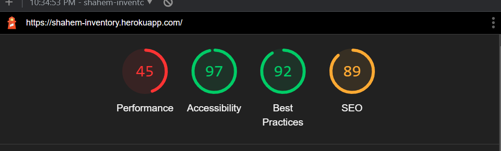

[Back to top](<#navigator>)

## Manual testing
- Show short welcome message, the instructions text and a list of choices is working as expected. 
- Choice Add sales is working as expected. It update sales worksheet give total sales then update stock worksheet give new stock.
- Choice Add buy is working as expected. It update buy worksheet give total buy then update stock worksheet give new stock.
- Choice Add damage is working as expected. It update damage worksheet give total damage then update stock worksheet give new stock.
- Choice Return to stock is working as expected. It update stock worksheet give new stock.
- Choice Return to damage is working as expected. It update damage worksheet give total damage.
- Choice Storage capacity is working as expected. It chick the now stock if is smeller than 1000 deduct the new stock from 1000 and print Storage capacity if it bigger than 1000 print Storage is full.
- Choice Exit is working as expected.
- Choice Go back is working as expected. It clear terminal and show  the list of choices

[Back to top](<#navigator>)

## User stories testing
- As a user, I want to understand the purpose of this site upon loading it.

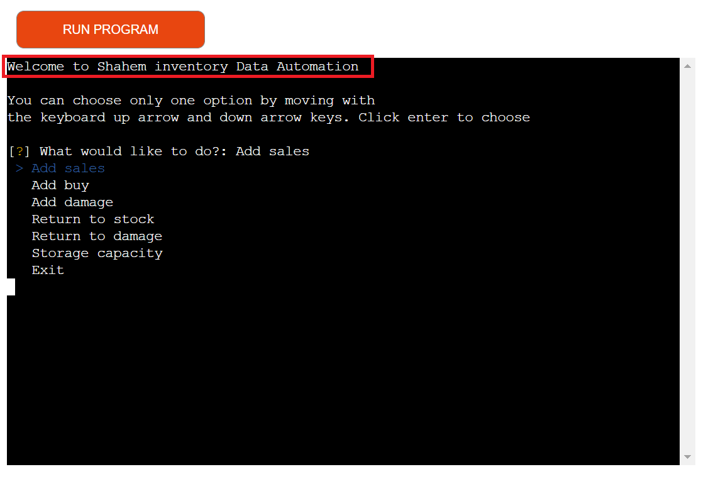

- As a user, I want to be able to know what are the instructions to use this site.

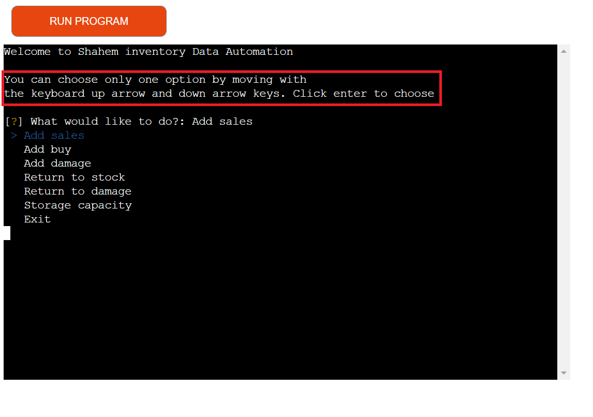

- As a user, I want to be able to add sales to the total sales and update the stock.

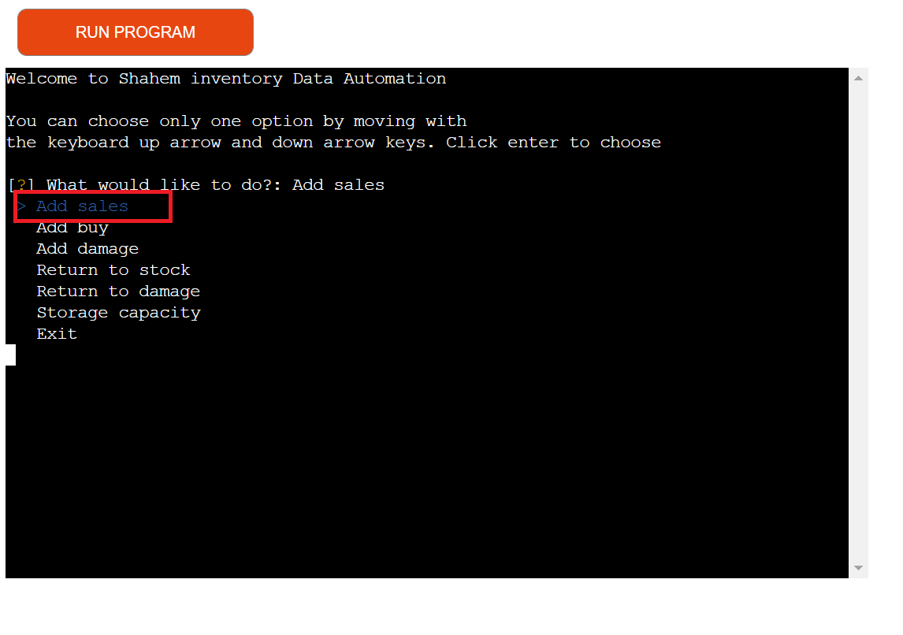

- As a user, I want to be able to add buy to the total buy and update the stock.

- As a user, I want to be able to add damage to the total damage and update the stock.

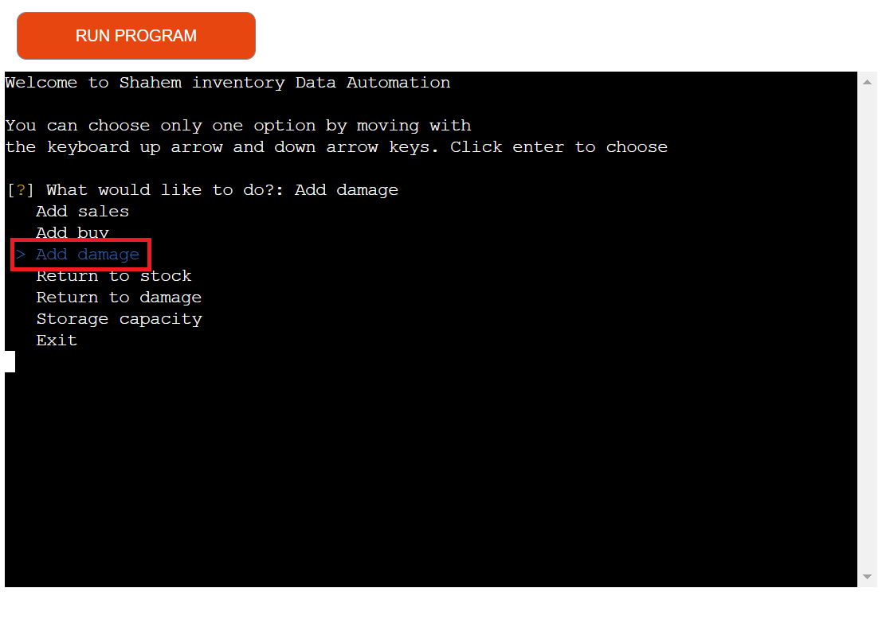

- As a user, I want to be able to return to stock update the stock.

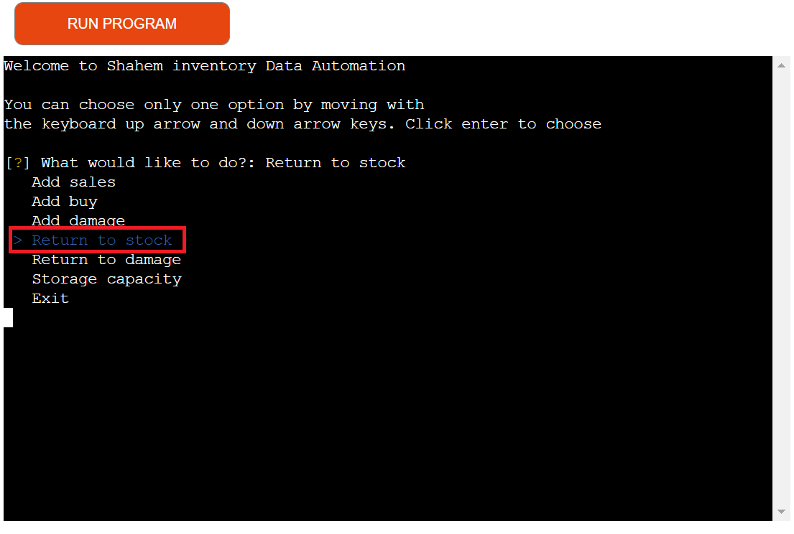

- As a user, I want to be able to return to damage update the damage.

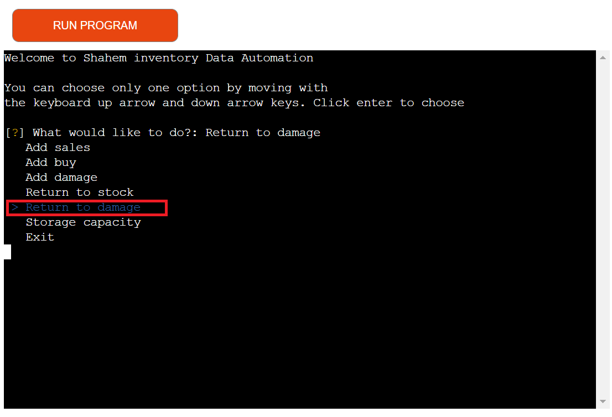

- As a user, I want to be able to see storage capacity.

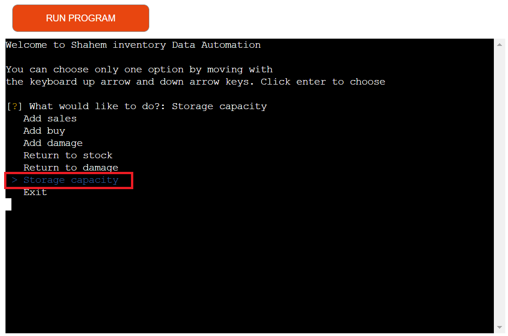

- As a user, I want to be able to exit site.

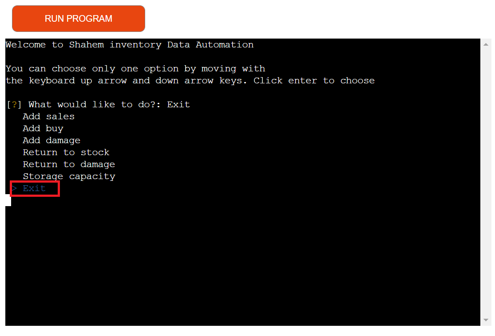

- As a user I want have an easy way of getting back to the main menu.

