# Shahem inventory
- Shahem inventory is a site that hopes to demonstrate how pure python works in a real-world context. 
- The site will be targeted users who want to get report over there inventory after the inter data.
- It will show that the storage is full if the stock for ech item arrive to 1000
- Shahem inventory is a application will have a command line interface in python.
- Shahem inventory site will show the users the a lest of options:
  - Add sales.
  - Add buy.
  - Add damage.
  - Return to stock.
  - Return to damage.
  - Storage capacity.
  - Exit.

[Shahem inventory](https://shahem-inventory.herokuapp.com/) site.

# Navigator

- [**User experience UX**](<#user-experience-ux>)
    - [User stories](<#user-stories>)
    - [Flow chart diagram](<#flow-chart-diagram>)
    - [Site structure](<#site-structure>)
    - [Data Model](<#data-model>)
- [**Features**](<#features>)
    - [Existing features](<#existing-features>)
    - [Python functions](<#python-functions>)
        - [Show list](<#show-list>)
        - [Main](<#main>)
        - [Go back](<#go-back>)
        - [Main sales](<#main-sales>)
        - [Main buy](<#main-buy>)
        - [Main damage](<#main-damage>)
        - [Main return stock](<#main-return-stock>)
        - [Main return damage](<#main-return-damage>)
        - [Storage capacity](<#storage-capacity>)
        - [Get input](<#get-input>)
        - [Validate data](<#validate-data>)
        - [Update worksheet](<#update-worksheet>)
        - [Calculate total](<#calculate-total>)
        - [Update stock worksheet deduct](<#update-stock-worksheet-deduct>)
        - [Update stock worksheet add](<#update-stock-worksheet-add>)
        - [Update damage worksheet add](<#update-damage-worksheet-add>)
    - [Future features](<#future-features>)
- [**Technologies used**](<#technologies-used>)
- [**Python Packages**](<#python-Packages>)        
- [**Testing**](<#testing>)
    - [Code Validation](<#code-validation>)
    - [Browser Compatibility](<#browser-compatibility>)
    - [Responsiveness Test](<#responsiveness-test>)
    - [Lighthouse](<#lighthouse>)
    - [Manual testing](<#manual-testing>)
    - [User stories testing](<#user-stories-testing>)
    - [Fixed bugs](<#Fixed-bugs>)
- [**Deployment**](<#deployment>)
    - [To deploy the project](<#to-deploy-the-project>)
    - [To fork the repository on GitHub](<#to-fork-the-repository-on-github>)
    - [To create a local clone of this project](<#to-create-a-local-clone-of-this-project>)
- [**Credits**](<#credits>)
    - [Content](<#content>)    
- [**Acknowledgements**](<#acknowledgements>)      

# User experience (UX)

## User stories

- As a user, I want to understand the purpose of this site upon loading it.
- As a user, I want to be able to know what are the instructions to use this site.
- As a user, I want to be able to add sales to the total sales and update the stock.
- As a user, I want to be able to add buy to the total buy and update the stock.
- As a user, I want to be able to add damage to the total damage and update the stock.
- As a user, I want to be able to return to stock update the stock.
- As a user, I want to be able to return to damage update the damage.
- As a user, I want to be able to see storage capacity.
- As a user, I want to be able to exit site.
- As a user I want have an easy way of getting back to the main menu.

[Back to top](<#navigator>)

## Flow chart diagram

- The site steps overview.
- Explain the flow of the site.
- Shows the sequence of triggering the site's functionalities.
- Plan and write efficient functions.

<b>Flow chart diagram</b>

 

[Back to top](<#navigator>)

## Site structure

- Shahem inventory is a terminal based application that is being presented in a one page website.
- When the application starts the user see a short welcome message, the instructions and a list of choices
 
[Back to top](<#navigator>)

## Data Model

To store all data in the application I made a choice to use Google Sheets. All data in the application is being sent and retrieved from the Google Sheet.

- Name of workbook: shahem_inventory
- Name of worksheet: sales
- Name of worksheet: buy
- Name of worksheet: damage
- Name of worksheet: stock

The worksheet holds 6 columns with information such as:
  T-shirt XS,T-shirt S,T-shirt M,T-shirt L,T-shirt XL,T-shirt XXL 
  that is being controlled from the application via Python.

 

<b>Google Sheet sales</b>

 
 

<b>Google Sheet buy</b>

 

<b>Google Sheet damage</b>

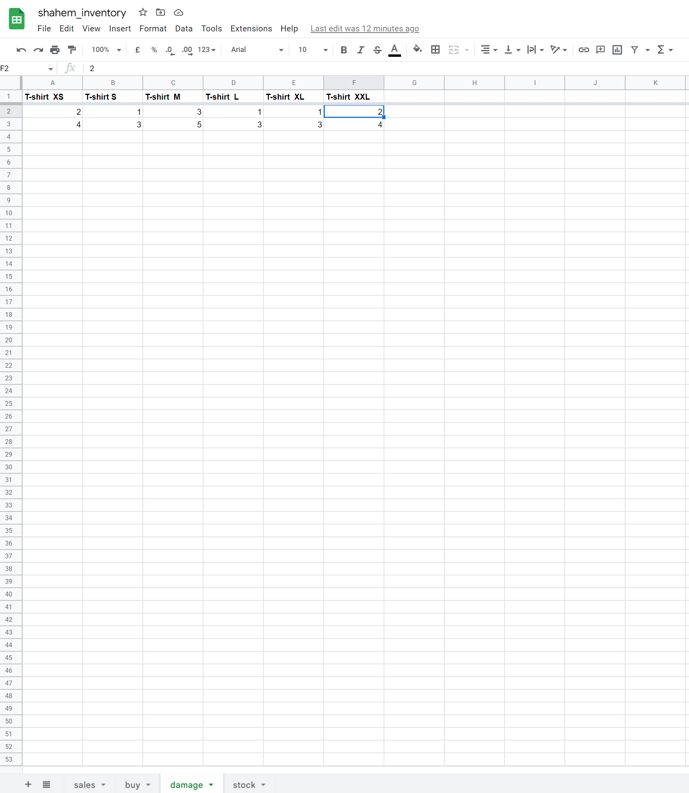

 
 

<b>Google Sheet stock</b>

 

[Back to top](<#navigator>)

# Features 

## Existing features

## Python functions

### Show list
- pint welcome message, print instructions, show list of choices with if condition statement to call one of the main functions

[Back to top](<#navigator>)

### Main
- Clear terminal using os-system package then call show_list function

[Back to top](<#navigator>)

### Go back
- Show list of choices, if the user choose go back choice it will call main function.
- if he choose exit choice it will print thank you message and exit the application.

[Back to top](<#navigator>)

### Main sales
- Get the input array from the user then convert it to integer.
- Update the sales worksheet and print total sales.
- Update stock sheet by deduct the sales input from the stock and, print new stock.
- Timeout for 2 sec, then call go_back function.

[Back to top](<#navigator>)

### Main buy
- Get the input array from the user then convert it to integer.
- Update the buy worksheet and print total buy.
- Update stock sheet by add the buy input to the stock and, print new stock.
- Timeout for 2 sec, then call go_back function.

[Back to top](<#navigator>)

### Main damage
- Get the input array from the user then convert it to integer.
- Update the damage worksheet and print total damage.
- Update stock sheet by deduct the damage input from the stock and, print new stock.
- Timeout for 2 sec, then call go_back function.

[Back to top](<#navigator>)

### Main return stock
- Get the input array from the user then convert it to integer.
- Update stock sheet by add the return to stock input to the stock and, print new stock.
- Timeout for 2 sec, then call go_back function.

[Back to top](<#navigator>)

### Main return damage
- Get the input array from the user then convert it to integer.
- Update the damage worksheet by add return to damage to damage and, print total damage.
- Timeout for 2 sec, then call go_back function.

[Back to top](<#navigator>)

### Storage capacity
- Get stock worksheet last row values then replace the comma with empty staring '' before convert it to integer.
- Then if num less than 1000 then (1000  - num).
- And if it is more than 1000 or equal print storage is full message.

[Back to top](<#navigator>)

### Get input
- Get sheet input from the user.
- Run a while loop to collect a valid string of data from the user.
- Which must be a string of 6 numbers separated by commas.
- The loop will repeatedly request data, until it is valid.

[Back to top](<#navigator>)

### Validate data
- Inside the try, converts all string values into integers.
- Raises ValueError if strings cannot be converted into int, or if there aren't exactly 6 values.

[Back to top](<#navigator>)

### Update worksheet
- Update worksheet, add new row with the list data provided and call calculate_total function.

[Back to top](<#navigator>)

### Calculate total
- Calculate total for each sheet by using for loop.
- Get worksheet columns values. 
- Remove the first index. 
- Then replace the comma with empty staring '' before convert it to integer.
- Then sum the column.
- Then append to now array.
- print total.

[Back to top](<#navigator>)

### Update stock worksheet deduct
- Update stock worksheet, by adding new row with using zip method to be able to deduct the last input from the stock.
- Print the new stock.

[Back to top](<#navigator>)

### Update stock worksheet add
- Update stock worksheet, by adding new row with using zip method to be able to add the last input to the stock.
- Print the new stock.

[Back to top](<#navigator>)

### Update damage worksheet add
- Update damage worksheet, by adding new row with using zip method to be able to add the last input to the damage.
- Print the total damage.

[Back to top](<#navigator>)

# Technologies used
- [Python](https://en.wikipedia.org/wiki/Python_(programming_language)) - Provides the functionality for the application.
- [Google Sheets](https://www.google.co.uk/sheets/about/) - Used to host the application data.
-  - used to create the flow chart diagram.
- [Gitpod](https://www.gitpod.io/#get-started) - used to deploy the website.
- [Github](https://github.com/) - used to host and edit the website.
- [Heroku](https://en.wikipedia.org/wiki/Heroku) - A cloud platform that the application is deployed to.

[Back to top](<#navigator>)

# Python Packages
- [GSpread](https://pypi.org/project/gspread/) - A Python package that makes it possible to transfer data between the application and the Google Sheet.
- [Sys](https://docs.python.org/3/library/sys.html) - A module that provides access to used or maintained by the interpreter and to functions that interact strongly with the interpreter. It is always available (*text taken from [here](https://docs.python.org/3/library/sys.html)*)
- [OS](https://docs.python.org/3/library/os.html) - A module that provides a portable way of using OS dependent functionality.
- [inquirer]() - python package provides list of choices
- [Time](https://docs.python.org/3/library/time.html) - A module that provides various time-related functions

[Back to top](<#navigator>)

# Testing 

## Code Validation

### Python

* No errors were returned when passing through the official [CI Python Linter](https://pep8ci.herokuapp.com/)

[Back to top](<#navigator>)

## Browser Compatibility

- Shahem inventory site was tested on the following browsers Google Chrome, Safari and Mozilla Firefox.
- Appearance, functionality and responsiveness were consistent on a range of different device sizes and browsers.

[Back to top](<#navigator>)

## Responsiveness Test

* The responsive tests were exercised by using [Google Chrome DevTools](https://developer.chrome.com/docs/devtools/).

|        | iPad mine | Galaxy S5 | iPhone 6/7/8 | iPad | iPad Pro | iPhone 6/7/8 plus | Display >950px  |
|--------|-----------|-----------|--------------|------|----------|-------------------|-----------------|
| Text   | pass      | pass      | pass         | pass | pass     | pass              | pass            |

[Back to top](<#navigator>)

## Lighthouse
Shahem inventory site was also tested using [Google Lighthouse](https://developers.google.com/web/tools/lighthouse) in Chrome Developer Tools to test the page for:
- Performance - How the page performs whilst loading.
- Accessibility - Is the site accessible for all users and how can it be improved.
- Best Practices - Site conforms to industry best practices.
- SEO - Search engine optimization. Is the site optimized for search engine result rankings.

[Back to top](<#navigator>)

## Manual testing
- Show short welcome message, the instructions text and a list of choices is working as expected. 
- Choice Add sales is working as expected. It update sales worksheet give total sales then update stock worksheet give new stock.
- Choice Add buy is working as expected. It update buy worksheet give total buy then update stock worksheet give new stock.
- Choice Add damage is working as expected. It update damage worksheet give total damage then update stock worksheet give new stock.
- Choice Return to stock is working as expected. It update stock worksheet give new stock.
- Choice Return to damage is working as expected. It update damage worksheet give total damage.
- Choice Storage capacity is working as expected. It chick the now stock if is smeller than 1000 deduct the new stock from 1000 and print Storage capacity if it bigger than 1000 print Storage is full.
- Choice Exit is working as expected.
- Choice Go back is working as expected. It clear terminal and show the list of choices.

[Back to top](<#navigator>)

## User stories testing
- As a user, I want to understand the purpose of this site upon loading it.

<b>Understand the purpose of this site</b>

 

- As a user, I want to be able to know what are the instructions to use this site.

<b>Understand the instructions of this site</b>

 

- As a user, I want to be able to add sales to the total sales and update the stock.

<b>Add sales</b>

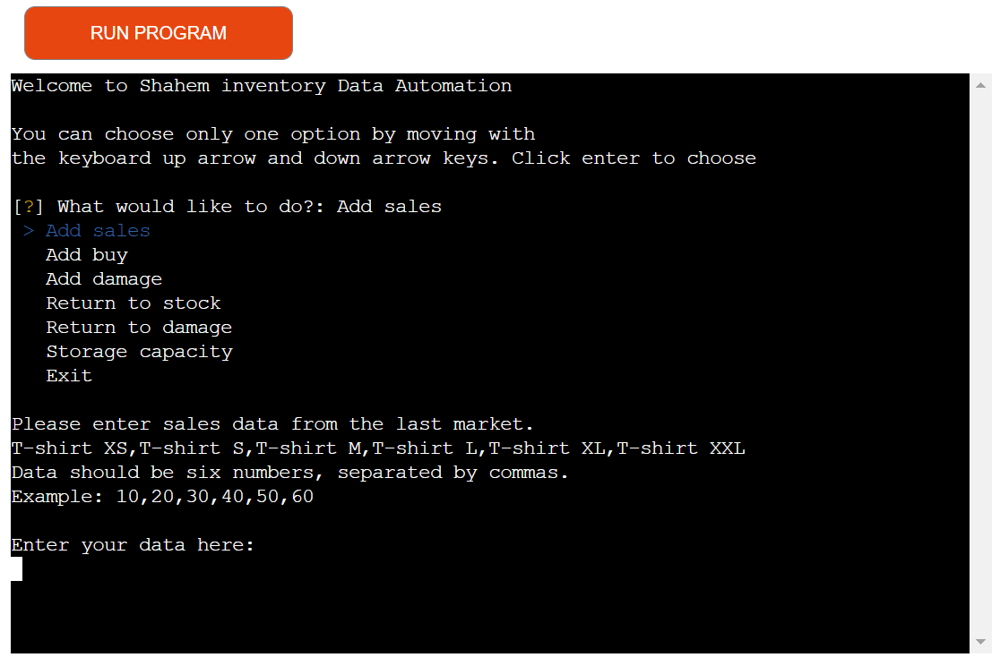
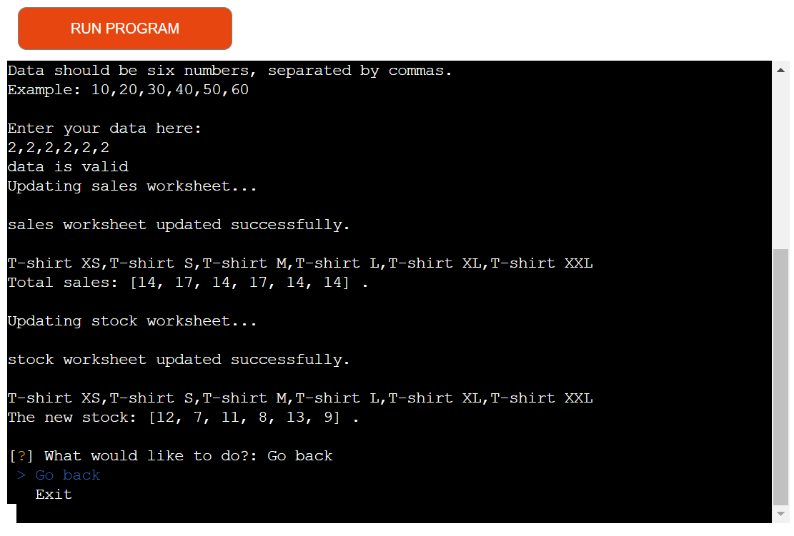

 

- As a user, I want to be able to add buy to the total buy and update the stock.

<b>Add buy</b>

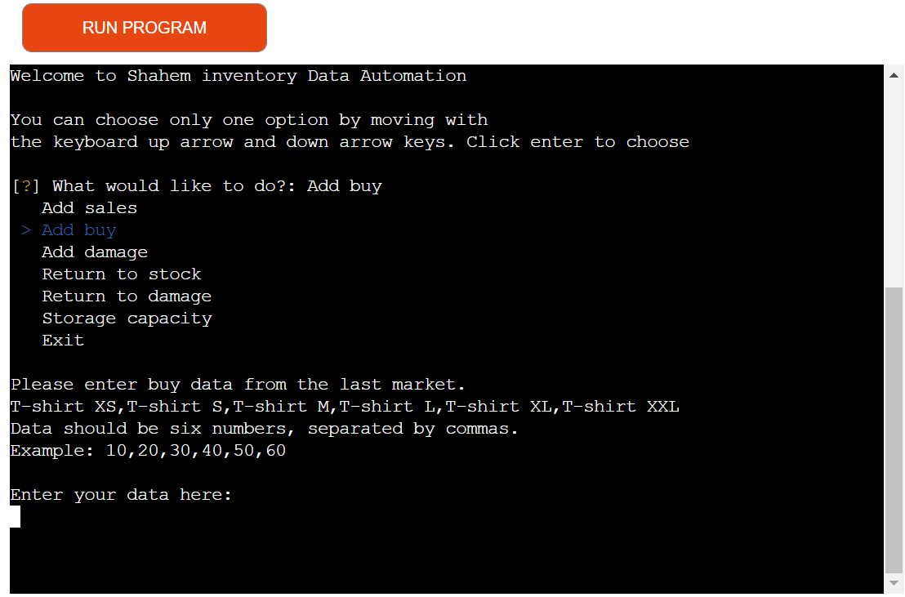
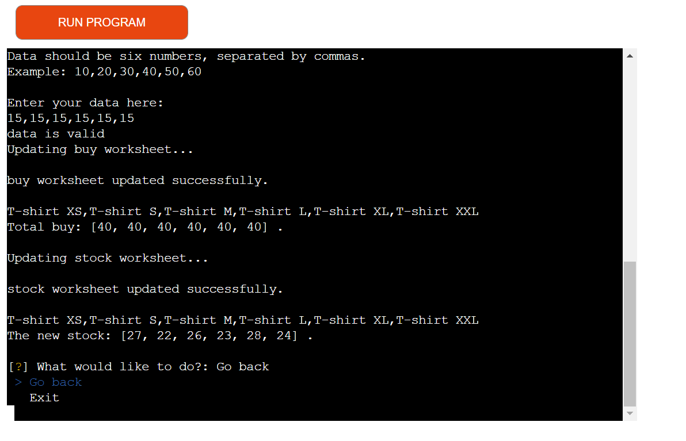

 

- As a user, I want to be able to add damage to the total damage and update the stock.

<b>Add damage</b>

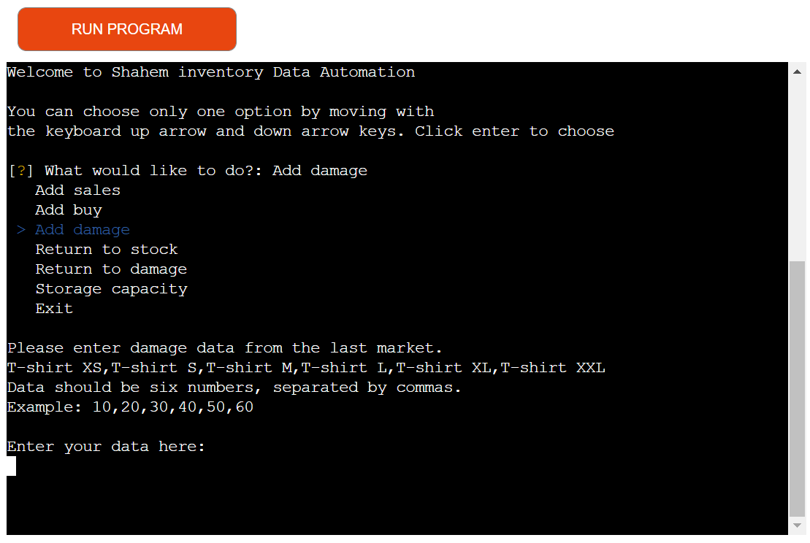
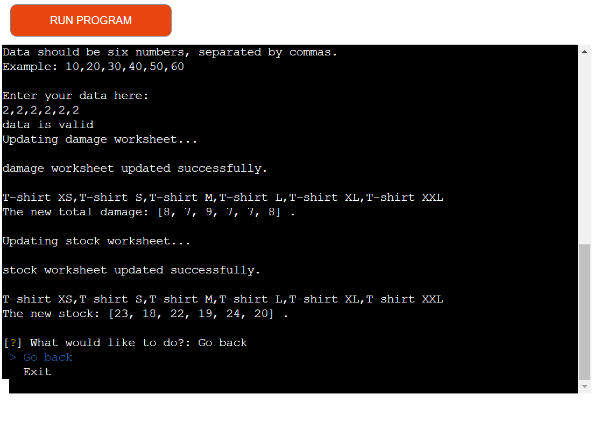

 

- As a user, I want to be able to return to stock update the stock.

<b>Return to stock</b>

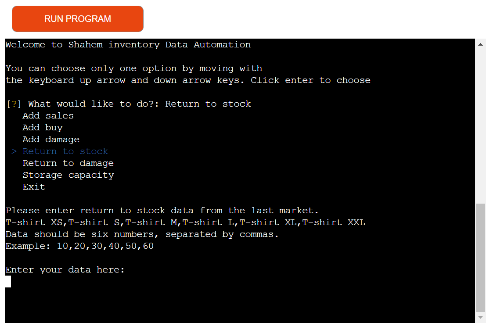
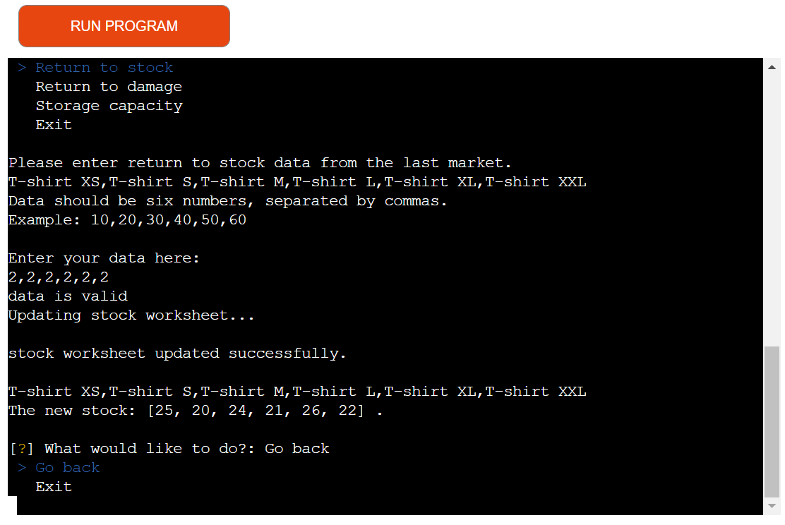

 

- As a user, I want to be able to return to damage update the damage.

<b>Return to damage</b>

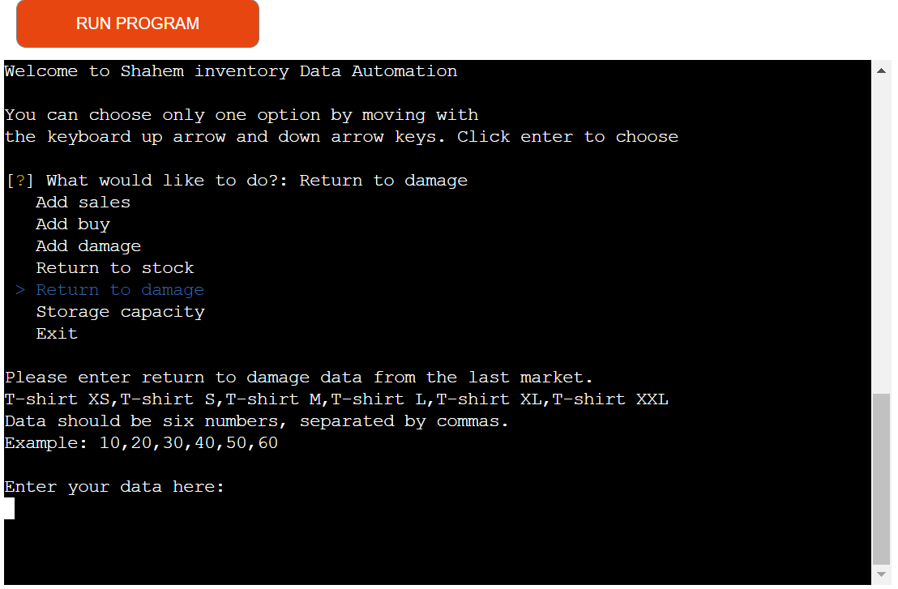
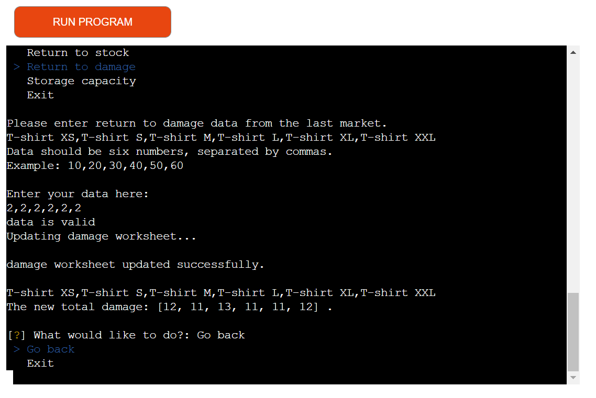

 

- As a user, I want to be able to see storage capacity.

<b>Storage capacity</b>

 

- As a user, I want to be able to exit site.

<b>Exit</b>

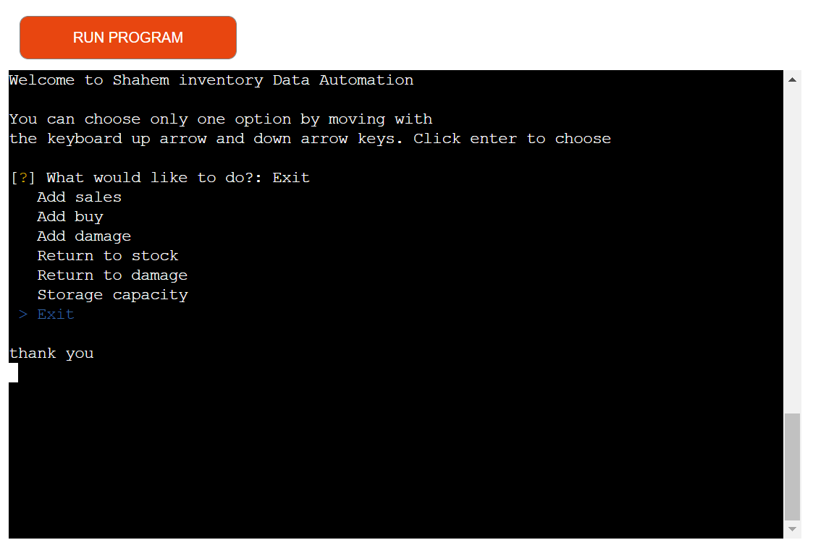
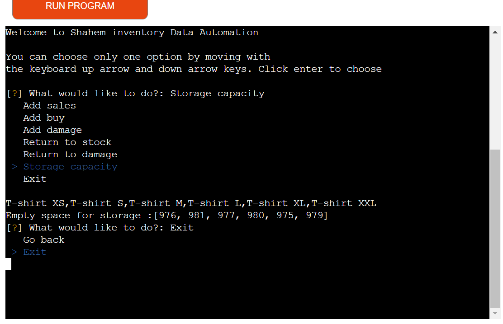

 

- As a user I want have an easy way of getting back to the main menu.

<b>Go back</b>

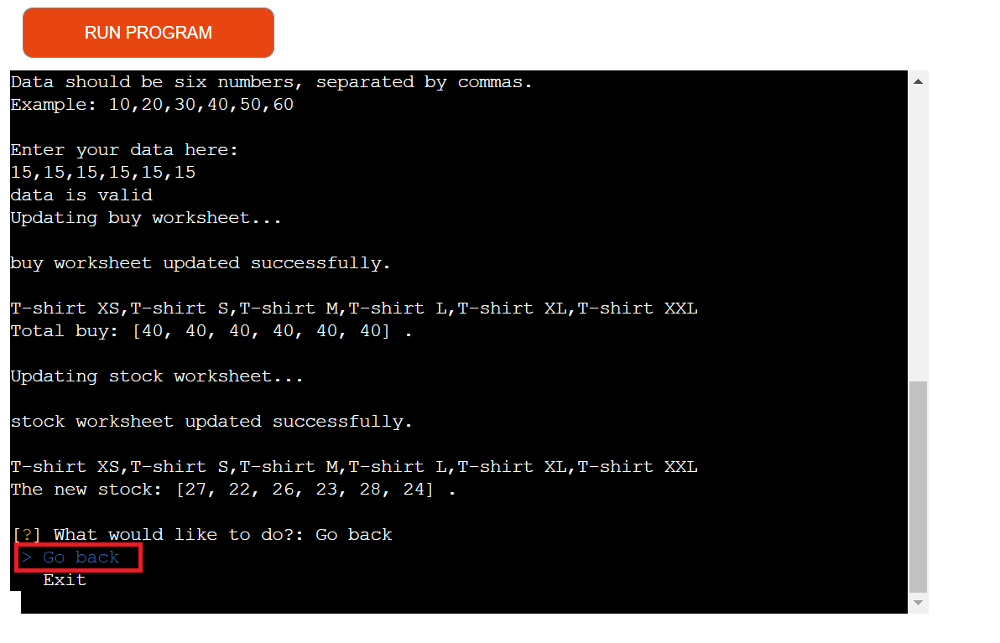
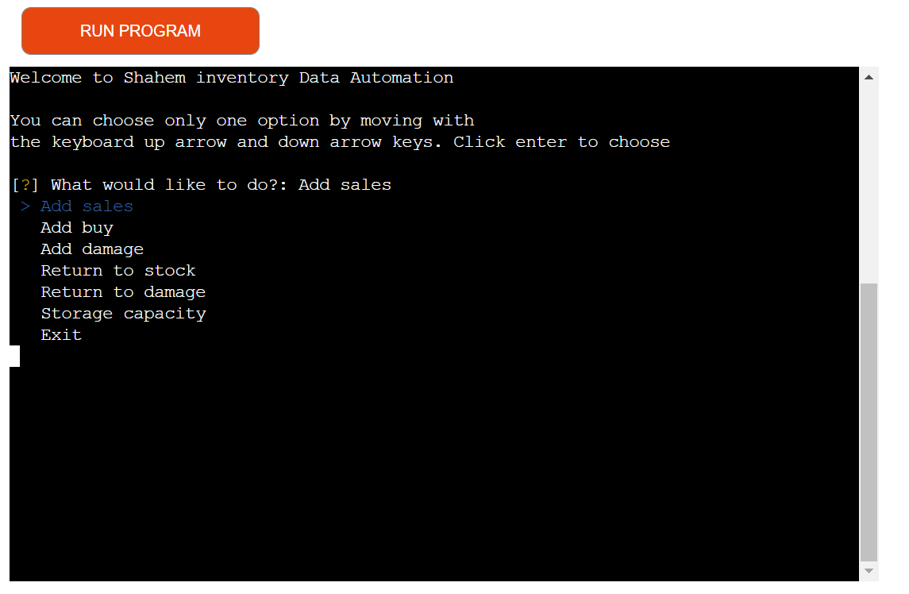

 

[Back to top](<#navigator>)

## Fixed bugs

[Back to top](<#navigator>)

# Deployment

## To deploy the project
The project was deployed to [Heroku](https://www.heroku.com). To deploy,I follow the process below:
  1. The first step is to log in to Heroku (or create an account if needed).
  2. In the top right corner there is a button that is labeled 'New'. Click that and then select 'Create new app'.
  3. Enter an application name that needs to be unique. When you have chose the name, choose your region and click 'Create app".
  4. On the next page, click the 'Settings' tab and find the "Config Vars" section. When you have found it, click "Reveal Config Vars". add values.(KEY input field = "CREDS", VALUE input field = "your credentials"
  5. Next step is to add buildpacks to the application which will run when the application is deployed. The reason why this is needed is because all dependencies and configurations will be installed for the application. To do this you scroll down to the buildpacks section on the settings page and click the button 'Add buildpack'.
  6. Add "Python" and node.js". It is important that Python is listed above node.js.
  7. Scroll to the top of the settings page and click the 'Deploy' tab. For deployment method, select 'Github'. Search for the repository name you want to deploy and then click connect.
  8. Scroll down on the deploy page and choose deployment type. Choose to enable automatic deployments if you want to and then click 'Deploy Branch'.

  [Shahem inventory](https://shahem-inventory.herokuapp.com/) site.

[Back to top](<#navigator>)

## To fork the repository on GitHub
A copy of the GitHub Repository can be made by forking the GitHub account. This copy can be viewed and changes can be made to the copy without affecting the original repository. Take the following steps to fork the repository;
1. Log in to **GitHub** and locate the [repository](https://shahemnezameddin.github.io//).
2. On the right-hand side of the page inline with the repository name, is a button called **'Fork'**. Click on the button to create a copy of the original repository in your GitHub Account.

[Back to top](<#navigator>)

## To create a local clone of this project
The method for cloning a project from GitHub is below:

1. Under the repository’s name, click on the **code** tab.
2. In the **Clone with HTTPS** section, click on the clipboard icon to copy the given URL.
3. In your IDE of choice, open **Git Bash**.
4. Change the current working directory to where you want the cloned directory to be made.
5. Type **git clone**, then paste the URL copied from GitHub.
6. Press **enter**, and the local clone will be created.

[Back to top](<#navigator>)
 
# Credits 

### Content 

- The flow chart diagram were created by .
- The idea came from Code Institute course materials and youtube videos.
- The inspiration for using google sheet came from Love_sandwiches project.

[Back to top](<#navigator>)

# Acknowledgements
I want to thank:
- My mentor [Precious Ijege](https://www.linkedin.com/in/precious-ijege-908a00168/) for guidance and support.
- Slack community and Code Institute crew for their help and support.
- My family and friends, for their user experience and feedback.

[Back to top](<#navigator>)

